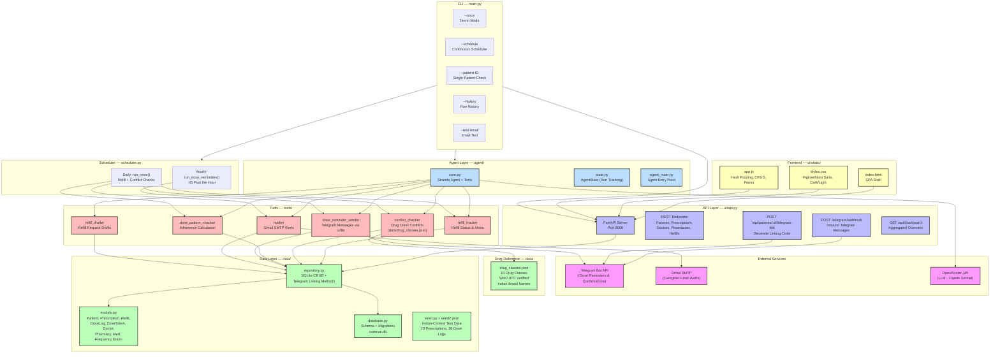

```mermaid
graph TB
    subgraph External["External Services"]
        Telegram["Telegram Bot API<br/>(Dose Reminders & Confirmations)"]
        Gmail["Gmail SMTP<br/>(Caregiver Email Alerts)"]
        OpenRouter["OpenRouter API<br/>(LLM - Claude Sonnet)"]
    end

    subgraph Frontend["Frontend — ui/static/"]
        HTML["index.html<br/>SPA Shell"]
        CSS["styles.css<br/>Figtree/Noto Sans, Dark/Light"]
        JS["app.js<br/>Hash Routing, CRUD, Forms"]
    end

    subgraph API["API Layer — ui/api.py"]
        FastAPI["FastAPI Server<br/>Port 8000"]
        REST["REST Endpoints<br/>Patients, Prescriptions,<br/>Doctors, Pharmacies, Refills"]
        TGWebhook["POST /telegram/webhook<br/>Inbound Telegram Messages"]
        LinkCode["POST /api/patients/:id/telegram-link<br/>Generate Linking Code"]
        Dashboard["GET /api/dashboard<br/>Aggregated Overview"]
    end

    subgraph Agent["Agent Layer — agent/"]
        Core["core.py<br/>Strands Agent + Tools"]
        State["state.py<br/>AgentState (Run Tracking)"]
        AgentMain["agent_main.py<br/>Agent Entry Point"]
    end

    subgraph Tools["Tools — tools/"]
        RefillTracker["refill_tracker<br/>Refill Status & Alerts"]
        ConflictChecker["conflict_checker<br/>Drug Class Conflicts<br/>(data/drug_classes.json)"]
        DosePattern["dose_pattern_checker<br/>Adherence Calculation"]
        DoseReminder["dose_reminder_sender<br/>Telegram Messages via urllib"]
        Notifier["notifier<br/>Gmail SMTP Alerts"]
        RefillDrafter["refill_drafter<br/>Refill Request Drafts"]
    end

    subgraph DrugRef["Drug Reference — data/"]
        DrugJSON["drug_classes.json<br/>15 Drug Classes<br/>WHO ATC Verified<br/>Indian Brand Names"]
    end

    subgraph Scheduler["Scheduler — scheduler.py"]
        Hourly["Hourly: run_dose_reminders()<br/>:05 Past the Hour"]
        Daily["Daily: run_once()<br/>Refill + Conflict Checks"]
    end

    subgraph Data["Data Layer — data/"]
        Models["models.py<br/>Patient, Prescription, Refill,<br/>DoseLog, DoseToken, Doctor,<br/>Pharmacy, Alert, Frequency Enum"]
        Repo["repository.py<br/>SQLite CRUD +<br/>Telegram Linking Methods"]
        DB["database.py<br/>Schema + Migrations<br/>carecue.db"]
        Seed["seed.py + seed/*.json<br/>Indian-Context Test Data<br/>10 Prescriptions, 36 Dose Logs"]
    end

    subgraph CLI["CLI — main.py"]
        Once["--once<br/>Demo Mode"]
        Schedule["--schedule<br/>Continuous Scheduler"]
        Patient["--patient ID<br/>Single Patient Check"]
        History["--history<br/>Run History"]
        TestEmail["--test-email<br/>Email Test"]
    end

    %% Frontend to API
    HTML --> FastAPI
    CSS --> FastAPI
    JS --> FastAPI

    %% API to Data
    FastAPI --> Repo
    Repo --> DB
    Repo --> Models

    %% API to External
    TGWebhook --> Telegram
    LinkCode --> Telegram

    %% Agent to Tools
    Core --> RefillTracker
    Core --> ConflictChecker
    Core --> DosePattern
    Core --> DoseReminder
    Core --> Notifier
    Core --> RefillDrafter

    %% Agent to External
    Core --> OpenRouter

    %% Tools to Data
    RefillTracker --> Repo
    ConflictChecker --> Repo
    ConflictChecker --> DrugJSON
    DosePattern --> Repo
    DoseReminder --> Repo
    DoseReminder --> Telegram
    Notifier --> Repo
    Notifier --> Gmail
    RefillDrafter --> Repo

    %% Scheduler to Agent/Tools
    Hourly --> DoseReminder
    Daily --> RefillTracker
    Daily --> ConflictChecker
    Daily --> DosePattern
    Daily --> Notifier

    %% CLI to Everything
    CLI --> Agent
    CLI --> Scheduler
    CLI --> FastAPI

    %% Styling
    classDef external fill:#f9f,stroke:#333,stroke-width:2px
    classDef api fill:#bbf,stroke:#333,stroke-width:2px
    classDef data fill:#bfb,stroke:#333,stroke-width:2px
    classDef tools fill:#fbb,stroke:#333,stroke-width:2px
    classDef frontend fill:#ffb,stroke:#333,stroke-width:2px
    classDef agent fill:#bdf,stroke:#333,stroke-width:2px

    class Telegram,Gmail,OpenRouter external
    class FastAPI,REST,TGWebhook,LinkCode,Dashboard api
    class Models,Repo,DB,Seed,DrugJSON data
    class RefillTracker,ConflictChecker,DosePattern,DoseReminder,Notifier,RefillDrafter tools
    class HTML,CSS,JS frontend
    class Core,State,AgentMain agent
```
