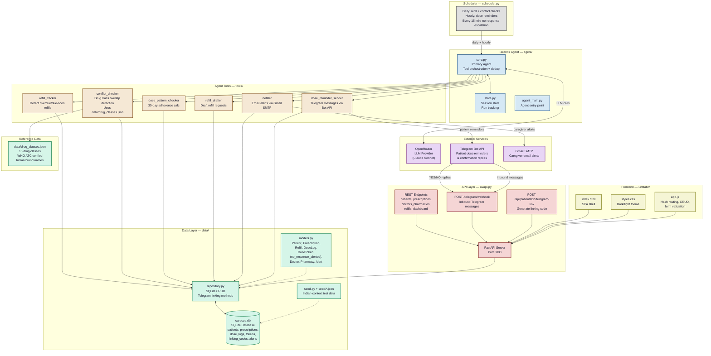

# CareCue System Architecture

## Data flow summary

1. **Scheduler** triggers the Strands Agent on a daily schedule (and hourly for dose reminders)
2. **Agent** calls 6 tools to check refills, conflicts, adherence, and send notifications
3. **Tools** read/write through `data/repository.py` to the SQLite database
4. **conflict_checker** also reads `data/drug_classes.json` (15 WHO ATC-verified drug classes) for therapeutic overlap detection
5. **notifier** sends caregiver alerts via Gmail SMTP
6. **dose_reminder_sender** sends patient reminders via Telegram Bot API
7. Patients reply YES/NO on Telegram → **webhook** receives the message → records dose log
8. **No-response escalation** (every 15 min): if patient hasn't replied within 90 minutes, caregiver gets an informational email — calm tone, not alarming
9. **FastAPI** serves the REST API and frontend dashboard independently, sharing the same data layer
